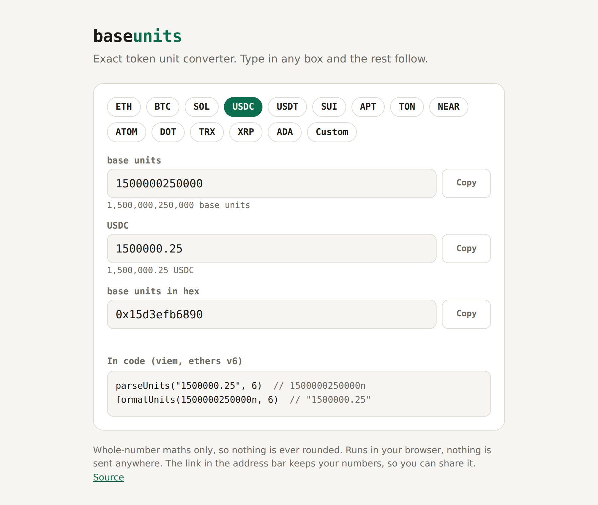

# baseunits

An exact token unit converter: wei, gwei, lamports, sats, or any number of decimals.

**Use it: https://khalydmaina.github.io/baseunits/**



## Why another converter

Because the obvious way to do this is wrong. In JavaScript:

```js
8.2 * 1e9    // 8199999999.999999   (should be 8200000000 lamports)
1.1 * 1e18   // 1100000000000000100 (should be 1100000000000000000 wei)
```

Floats cannot hold token amounts. `baseunits` does everything with whole
numbers (BigInt), so the answer is always exact, however many digits it has.

It also refuses to round. `0.0000001 USDC` does not exist, because USDC only
has 6 decimal places, so you get an error instead of a silently wrong number.

## What it does

- Converts both ways: type in any box and the others follow.
- Presets for ETH (wei, gwei), BTC, SOL, USDC, USDT, SUI, APT, TON, NEAR,
  ATOM, DOT, TRX, XRP and ADA, plus any custom number of decimals up to 36.
- Hex in and out, for reading calldata and logs.
- Accepts what people actually paste: `1,500,000.25`, `1_000_000`, `1e18`.
- Warns when an amount no longer fits in a u64 (Solana, Sui, Aptos) or a
  uint256.
- Shows the matching `parseUnits` and `formatUnits` calls for viem and ethers.
- Keeps the token and amount in the link, so
  `https://khalydmaina.github.io/baseunits/#usdc/1500000` opens on 1.5 USDC.

It is two static files, `index.html` and `units.js`. Nothing is sent anywhere,
and it works offline once loaded.

## Use the maths in your own code

`units.js` has no dependencies and works in Node and in the browser:

```js
const Units = require("./units.js");

Units.parseAmount("8.2", 9);          // 8200000000n
Units.formatAmount(1500000n, 6);      // "1.5"
Units.parseAmount("0.0000001", 6);    // throws: only has 6 decimal places
```

## Run it locally

```bash
python3 -m http.server      # then open http://localhost:8000
node --test tests/units.test.js   # unit tests
```

## Notes

- USDC and USDT are shown with 6 decimals, which is right on Ethereum, Solana,
  Tron and most chains. On BNB Chain they have 18: use Custom for that.
- Amounts cannot be negative.

## License

MIT
